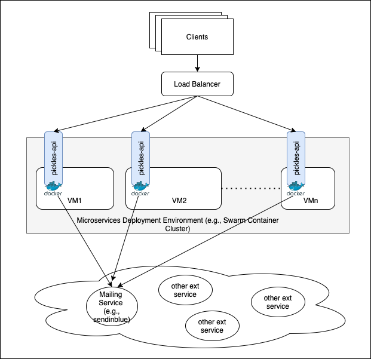

# Description

This app is a simple REST API app for emailing service with the following specifications:
* Accepts a JSON Payload via REST API
* Sends email via email delivery service to email address specied in the JSON payload.

# Specifications
## API Endpoints
This app implements three (3) simple API endpoints:

### GET `/` 
This endpoint will simply return welcoming message 

### GET `/healthz` 
* This endpoint return the status of a service and its dependencies.
* Having `health check API endpoint` is a quick and standardized way to validate the status of a microservice and its dependencies.
* Having health check API endpoint is recommended to ensure availability of a service.
* In this case, the `health status` of the API is implemented by simply checking the `uptime`.
 

### POST `/api/data` 
* This endpoint receives JSON payload and sends email via email delivery service to email address specied in the JSON payload.
* Since this API requires connection to external mail services (e.g., sendinblue mailing service), the implementation of `circuit-breaker` is possibly required to gracefully handle service unavailability.
* However, in this sample of pickles-api, the implementation of `circuit-breaker` is not implemented due to time constraint.
* As example, this app received a simple user data as payload.

    ```JSON
    {
        "id": "123", 
        "name": "name",
        "email": "user@outlook.com"
    }
    ```
    > __Note__: 
    > * No data validation is done. 
    > * Data validation can be performed with the help of `yup` modules 
---


## App Dependencies
The REST API is built with `typescript` and some dependencies are required.
The dependencies of this API are listed in `package.json`.
 
# Running Application
## Setting Up the API Service
1. Installing Dependencies:
    ```bash
    $ yarn install
    ```

    Now, you should now be able to run the application with hot reloading like so:

2. Running in Development environment using `yarn`
    ```bash
    $ yarn dev
    ```
3. Build and run the typescript as js app
    ```bash
    $ yarn build
    $ node dist/src/app.js
    ```

## Calling REST API

```bash
curl --location --request POST 'localhost:9090/hello' \
--header 'Content-Type: application/json' \
--data-raw '{
    "id": "123",
    "name": "zeldi",
    "email": "zeldi.syd@outlook.com"
}'
```

## Unit Test

### Dependencies

1. In implementing simple unit test for the REST API, we use `mocha` and `chai` modules.
2. To install dependencies for unit test, run the following command:
    ```bash
    $ yarn add chai chai-http mocha @types/chai @types/chai-http @types/mocha --save-dev
    ```
3. Test scripts are stored inside `/test` folder.

### Running Unit Test
1. Execute unit test with the following command:
    ```bash
    $ yarn test
    ..
    Testing GET (/) endpoint
        ✔ should return 'Welcome to Pickle API' on call

    Testing POST /api/data endpoint
        ✔ should return 'Data has been received' on call (1438ms)

    2 passing (1s)
    ``` 

## Deployment as Docker

1. Build container image
    ```bash
    $ docker build -t pickles:v1 .
    ```
2. Run the application API as container 
    ```bash
    $ docker run --rm -d -p 9090:9090 --name pickles pickles:v1
    ```
3. Test the API:
    ```bash
    curl --location --request POST 'localhost:9090/hello' \
    --header 'Content-Type: application/json' \
    --data-raw '{
        "id": "123",
        "name": "zeldi",
        "email": "zeldi.syd@outlook.com"
    }'
    ```
## Typical HA Microservices Deployment Environment

* Figure below highlights sample of architectural deployment of microservices:
* Typical environment to deploy microservices in production is in a container cluster such as `Swarm Cluster` or `Kubernetes Cluster`.
* Container Platform such as `Kubernetes` or `Swarm` will ensures the High Availabily and Scalability of the microservices.




## External Services
- sendinblue.com (used as email service)

